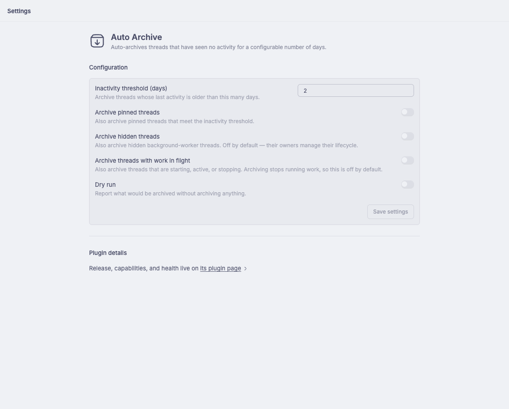

# bb-plugin-auto-archive

A BB plugin that keeps your thread list clean by **auto-archiving threads
that have had no activity for a configurable number of days** (default 2).

## Screenshots



*The plugin's settings page: inactivity threshold and archive policy.*

## What it's for

Thread lists accumulate. An issue you investigated once, a one-off question
you got an answer to, a background task that finished — none of them need to
sit in your active list forever. This plugin sweeps every hour and archives
anything that has been completely quiet for the whole window, so your sidebar
stays a list of things you're actually working on.

It is deliberately conservative: only threads that are **fully idle** and
**completely quiet for the full window** get archived. Nothing you're working
on, waiting on, or keeping handy gets touched.

## Quickstart

```sh
bb plugin install git:https://github.com/slogsdon/bb-plugin-auto-archive.git
```

That's it — the plugin records an install timestamp and sweeps hourly. Check
what it has done:

```sh
bb auto-archive status          # current config + last sweep result
bb auto-archive run --dry-run   # preview what the next sweep would archive
```

### First-run safety

A fresh install is deliberately conservative: it records when it was
installed and **only considers threads that became idle after that point**.
Threads that were already sitting idle in your backlog when you installed
are never auto-archived, and nothing is touched until the full inactivity
window has elapsed since install. So enabling it on a stale list of threads
won't silently archive them behind your back.

## What counts as activity

The sweep uses bb's `latestAttentionAt` — the most recent turn completion,
error, or thread creation. **Reading a thread, renaming it, or moving it
between sections does not count as activity**, so merely opening a thread
never keeps it alive.

A thread is only a candidate when *all* of these hold:

| Condition | Default |
| --- | --- |
| No activity for the full window (`latestAttentionAt` older than threshold) | required |
| Last activity happened **after** the plugin was installed | required |
| Root thread — child threads are never archived directly; they follow their parent's archive | required |
| Not pinned | skipped unless `archivePinned` |
| Not a hidden background-worker thread | skipped unless `archiveHidden` |
| Not running (starting / active / stopping) — archiving stops running work | skipped unless `archiveRunning` |
| Not already archived or deleted | required |

## Configuration

```sh
bb plugin config auto-archive set inactivityDays 3     # threshold (days), default 2
bb plugin config auto-archive set archivePinned true   # also archive pinned threads
bb plugin config auto-archive set archiveHidden true   # also archive hidden workers
bb plugin config auto-archive set archiveRunning true  # also archive running work
bb plugin config auto-archive set dryRun true          # log candidates, never archive
```

Settings are re-read on every sweep, so changes apply on the next hourly run
without a reload. `dryRun` is the safe way to preview before enabling
anything aggressive. New installs only watch threads that go idle after
install; pre-existing idle threads are never archived.

## CLI

```sh
bb auto-archive run            # run a sweep now
bb auto-archive run --dry-run  # preview without archiving anything
bb auto-archive status         # configuration + last sweep result
```

## How it works

- `bb.background.service("sweeper")` sweeps once on load, then sleeps until
  the next top-of-hour and repeats (abort-aware on reload/disable).
- Each sweep pages through non-archived root threads, selects stale
  candidates, archives them one at a time (a failure is logged and counted,
  the rest continue), and records the outcome for `bb auto-archive status`.
- Per-thread and per-sweep logs: `bb plugin logs auto-archive`.

## Development

```sh
npm test          # vitest: pure sweep logic + fake-host backend tests
npx tsc --noEmit  # typecheck
bb plugin build   # emit dist/ before publishing
```

## License

MIT — see [LICENSE](LICENSE).
